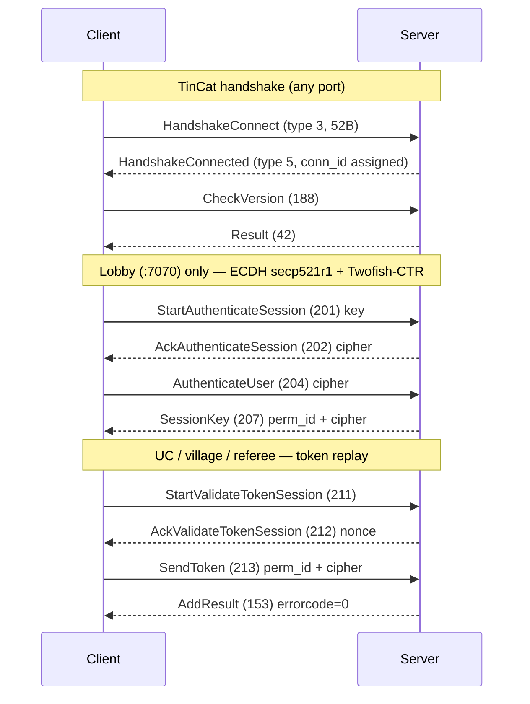
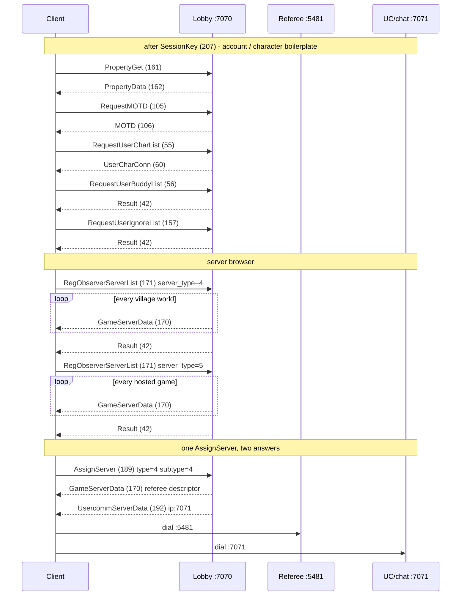
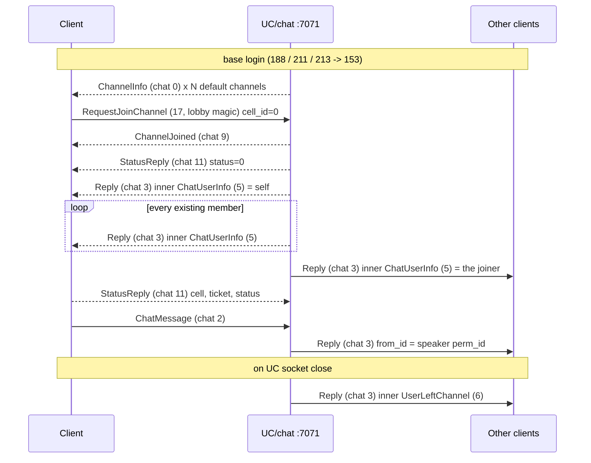
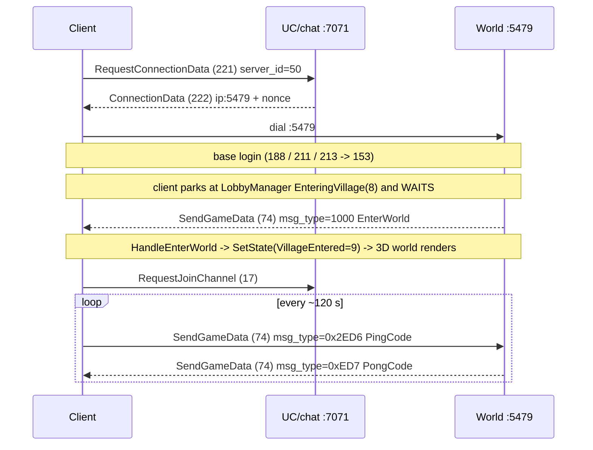
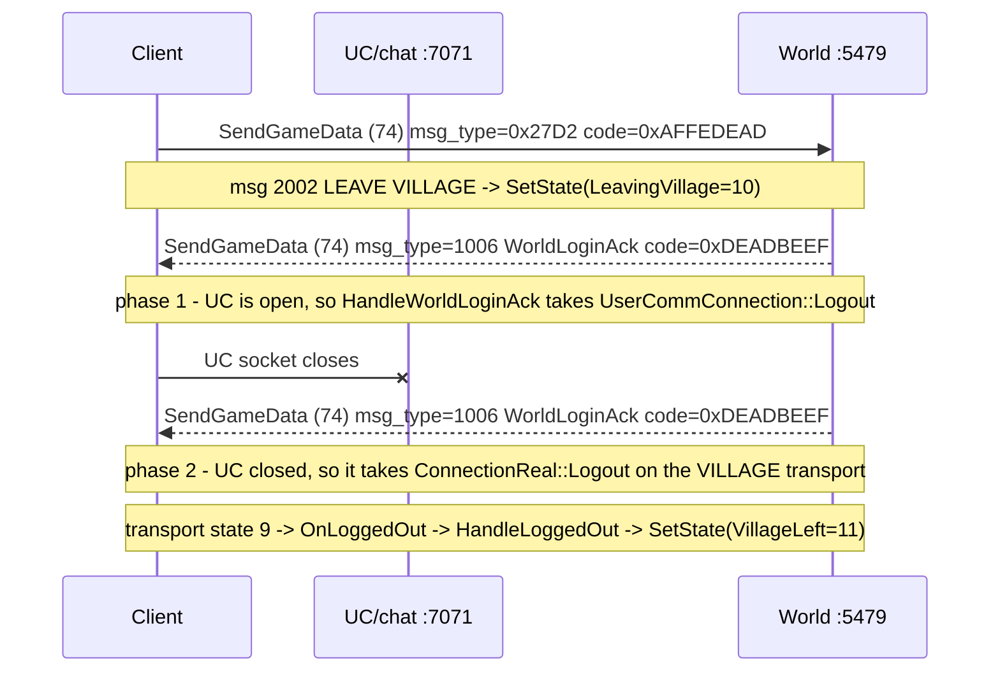
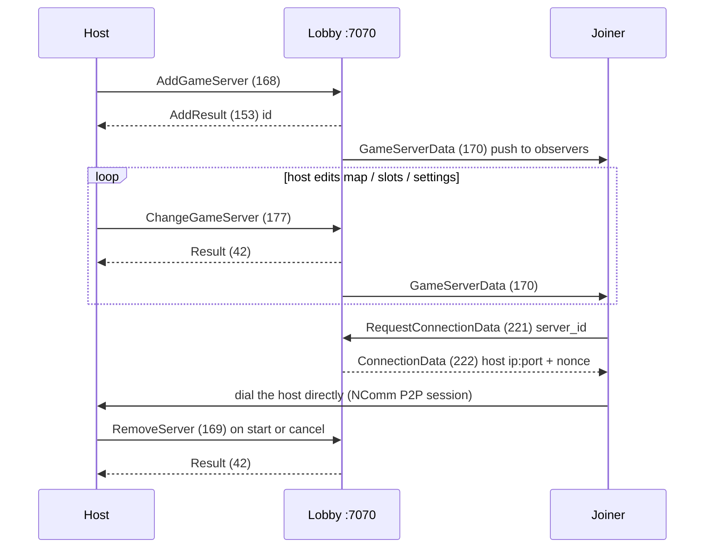
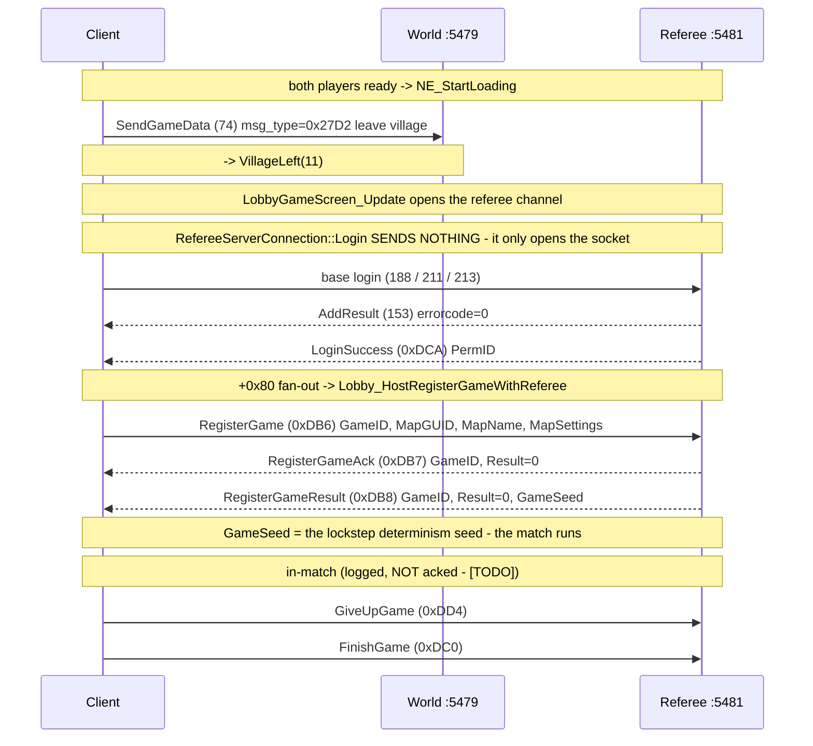

# TinCat3 protocol used by Die Siedler: Aufbruch der Kulturen (SAdK)

Companion to the [S2 DNG lobby emulator's `API.md`](https://github.com/S2-modders/Settlers-DNG-lobby-emulator/blob/dev/API.md),
written for **SAdK** — the German standalone on the same DNG engine, which adds a second
(UC/chat) connection, a village/world connection and a **referee** (match-arbiter) connection
on top of the DNG lobby.

This is a **flow-level** reference: what talks to what, in which order, and with which IDs.
The per-message field layouts are in the game's own `msgdefs.ini` (bundled at
`sadk_lobby/data/msgdefs.ini`) — **that file is authoritative** and overrides anything here.
The prose reference is `docs/LOBBY_PROTOCOL.md`; the implementation is `sadk_lobby/`.

Status legend, per `HARNESS.md`: **[PROVEN]** = binary address + live evidence ·
**[TODO]** = modelled but not confirmed.

---

## Connections

The client opens **four** TinCat sockets against the lobby infrastructure. All four run the
**same** app-payload magic (`0x26B6`) and the **same** base login; they differ only in which
message set the client routes to them.

| Port | Role | Client class | Login | Notes |
|------|------|--------------|-------|-------|
| `7070` | Lobby | `LobbyServerConnection` | ECDH (201/202) + credentials (204) | account, characters, server browser |
| `7071` | UC / chat | `UserCommConnection` | token (211/213 → **153**) | chat channels, second `AssignServer` target |
| `5479` | Village / world | `VillageServerConnection` | token (211/213 → **153**) | the 3D lobby world |
| `5481` | Referee | `RefereeServerConnection` | token (211/213 → **153**) + pushed `LoginSuccess` | match arbiter; gates match start |

The client learns `7071` from `UsercommServerData (192)`, and `5479` / `5481` from
`ConnectionData (222)` — never from the server list. See **Addressing** below.

---

## Package Flow

### Base login — identical on all four connections

Every socket starts the same way. Only the credential step differs: the lobby connection does
the full ECDH exchange, the other three replay a **token** minted from the lobby's `perm_id`.



> **[PROVEN]** The token login completes on a **`153 AddResult`**, not a `214 ValidateToken`.
> The client's UC state machine has no case for 214 (jump-table bound `0xAA`), so a 214 is
> dropped as "invalid message-type" and the login hangs. `153` with `errorcode == 0` drives
> connState → 8 (AUTHORIZED) → the `LoggedIn` callback.
> The `212` nonce is never echoed in clear — it is encrypted *inside* the 213 token.

### Lobby connection (`:7070`)



> The boilerplate block above is one **captured** ordering (`tincat_lobby_unhandled.log`). The
> client also issues `RequestUsers (53)`, `RequestCharacters (72)` and `RequestUserKeyList (158)`
> in this phase; their relative position is **not pinned** and is not load-bearing — each is a
> plain request/reply pair. The one anchor that is: `RequestUserIgnoreList (157)` is the **last**
> message of the lobby login.
>
> **[PROVEN]** The single `189` the client sends at login is `server_type=4, server_subtype=4`
> and the stub answers it **twice**, because the two replies take different paths inside
> `tincat3.dll`: the `170` is consumed by the assign ticket (kind `0x108`) and routes through
> `GameServerManager_OnGameServerAssigned@0x10021520` → `LobbyServerList_GameServerAssigned@0x469ad0`
> → `SetRefereeServerAddress@0x4625d0` → latched at `LobbyManager+0x580`; the `192` is consumed by
> the generic CommLayer `0xc0` handler that dials the UC server.
>
> ⚠️ The referee descriptor **must not** be `type4/sub5`. `CMP byte ptr [ESI+0x29],5` at
> `0x1002152e` is the only test of subtype 5 in the whole DLL and it diverts the message to a
> tincat3-private handler that never notifies the lobby, so `LM+0x580` never latches.
> The tell that the latch worked is the **exact-60 s `189` retry cadence**.
>
> ⚠️ Exactly **one** reply can take the assign path — the ticket is consumed once. Sending both
> a `4/5` and a `4/4` descriptor is a regression, not belt-and-braces.

### UC / chat connection (`:7071`)



> **[PROVEN 2026-07-27]** The client sends `RequestJoinChannel` with **`cell_id = 0`**, meaning
> *"server, assign me one."* Echoing `0` back confirms membership of a channel that does not
> exist, and the client answers with chat id **11 = `StatusReply{cell_id, ticket_id, status}`** —
> which is **bidirectional** — carrying `status = 2` (rejected). Assigning the Nth advertised
> channel to the Nth join gets `status = 0` and the roster works.
>
> Inner type `5 = ChatUserInfo` is live-confirmed; inner type `6 = UserLeftChannel` is
> **[TODO — INFERRED]**, and cosmetic. Whether `from_id` on a relayed line should be the speaker's
> `perm_id` or `serverID` is likewise **[TODO — INFERRED]**.

### Village / world connection (`:5479`) — entering the 3D lobby



> **[PROVEN, screenshot-confirmed]** World entry is driven **entirely by the server pushing
> `EnterWorld` (msg 1000) unprompted**. The player's "Betrete Welt" click sends **zero** network
> traffic; the client sits at `EnteringVillage(8)` until 1000 arrives, and
> `HandleEnterWorld` calls `SetState(VillageEntered=9)` as its *first* instruction.
>
> ⚠️ `1000` must ride a **`SendGameData (74)` envelope**. The client's inbound bridge only routes
> NETMSG 73/74 to `VillageServerConnection::HandleMessage` and uses the inner `msg_type` as the
> dispatch key — a bare `1000` frame is silently dropped.

### Leaving the village — two-phase



> **[PROVEN 2026-07-26]** `msg 1006` is the **logout trigger**, not an in-world ack, and
> `HandleWorldLoginAck@0x0046ec50` branches on whether the UserComm connection is still open —
> so a complete leave needs **two** of them, with the UC close in between.
>
> ⛔ **Live-falsified:** closing the village socket in answer to `2002` *does* complete the leave,
> but surfaces as `!CONNECTION_LOST_TEXT`, and at match start (where **both** clients send 2002)
> it kicked both players. Reverted.

### Hosting, browsing and joining a game



> The room/slot/tribe/team/ready protocol rides the **direct host↔joiner NComm session**, not the
> lobby — see `docs/NCOMM_GAME_PROTOCOL.md`. The lobby is purely the matchmaker.
>
> A hosted game is only **joinable** in the browser if its `170` carries a **ServerDataBlock** in
> the `data` MEMBLOCK — see **ServerDataBlock** below.

### Match start — the referee chain



> **[PROVEN 2026-07-27 — two matches back-to-back]** This is the whole match-start gate, and
> **every failure mode in it is silent**: the frame is accepted, the socket stays open, and
> nothing is logged anywhere. Four such bugs hid this chain. The two that bite hardest:
>
> 1. `RefereeServerConnection::Login@0x4793f0` **sends no message** — it only opens the channel.
>    Nothing on the wire ever requests a login result, so the server must **push**
>    `LoginSuccess (0xDCA)`. The `153` from the base login is the only cue there is.
> 2. `OnLoginSuccess@0x47ac20` compares the message's `PermID` field against `LobbyManager+0x54c`
>    (the logged-in user id) and on mismatch **returns silently — no log, no error**. A constant
>    would work for one player and silently fail for the other, so the pushed `PermID` must be
>    *that connection's* `perm_id`.
>
> Never send `LoginFailed (0xDCB)`.

---

## Headers & IDs

Hex below is **wire byte order** (little-endian), matching the DNG document's convention.

magic: `EFFBBADA` (`0xDABAFBEF`) \
payloadMagic: `B626` (`0x26B6`) — the **single** app-payload magic for lobby + UC + village + referee \
chatPayloadMagic: `6200` (`0x0062`) \
serverID: `CCFFFFEF` (`0xEFFFFFCC`) \
clientID: `EEFFFFEF` (`0xEFFFFFEE`)

### Header Types

2: ApplicationMessage \
3: HandshakeConnect \
5: HandshakeConnected \
11: Ping

### Frame layout — 28 bytes, then payload [PROVEN]

```
u32 Magic         0xDABAFBEF
u32 From          serverID on server->client, clientID / conn_id on client->server
u32 To            conn_id on server->client
u32 Type          see Header Types
u32 Unknown1      0
u32 PayloadSize
u32 Checksum      CRC32 over the payload
```

CRC32 uses the TinCat variant: polynomial `0xEDB88320`, **init 0**, **no final XOR**
(`sadk_lobby/tincat.py`). A `Ping (11)` needs no answer.

### HandshakeConnect payload — 52 bytes

```
u32   Magic          0xDABAFBEF
u32   ConnId         0 from the client; the server's reply carries the ASSIGNED id
char  Username[32]   the machine/Windows user
char  Password[8]    the serial
i32   Unknown1       echoed back verbatim
```

The reply is the same shape with `Password` = `2D 00 00 00 00 00 00 00`, sent as
`Type 5`, `From = serverID`, `To = clientID`.

### App payload prefix

```
u16 Magic     0x26B6
u16 Type1     the NETMSG type
u16 Type2     == Type1
... body
```

`Type2` is not redundancy: it **is** the msgdef's leading `type="UNSHORT"` field. The codec
therefore skips any field literally named `type` when encoding a body
(`sadk_lobby/msgdefs.py`, `codec.py`).

Chat frames replace the prefix with:

```
u16 Magic     0x0062
u16 Type      0
u16 Id        the chat message id (a small enum, separate from the NETMSG numbering)
... body
```

### Field encodings [PROVEN]

| msgdefs token | Wire |
|---|---|
| `UNBYTE` / `SIBYTE` / `UNSHORT` / `SISHORT` / `UNLONG` / `SILONG` | fixed-width **little-endian** scalar |
| `LBOOL` | 1 byte, 0/1 |
| `STRING n` | `i32` length **including the trailing NUL**, then iso-8859-15 bytes |
| `MEMBLOCK n` | `i32` length, then raw bytes (`n` is a *scratch-buffer* hint, not a wire length) |

⚠️ `None` and `""` are **not** the same string: `None` → a 4-byte zero length and nothing else;
`""` → length 1 plus a single NUL. Getting this wrong shifts every following field.

### ⚠️ Endianness — the one that costs you a live run

NETMSG **body** scalars are little-endian, as above. But anything serialized through the TinCat
**PropertySet / LobbyMessage** converter (`PropertyDataConverter@0x100110E0`) is **BIG-endian**:

* the `ServerDataBlock` `roomId` inside a `170` `data` MEMBLOCK,
* the village `code` property (`1006 WorldLoginAck`, and the client's own `2002` request),
* **every field of every referee LobbyMessage** (`PermID`, `GameID`, `Result`, `GameSeed`).

Both directions of this bug are silent. A little-endian `PermID = 1` reaches
`OnLoginSuccess` as `0x01000000`, mismatches the guard, and the handler returns without
logging anything. The little-endian `code` made the `1006` gate never fire *for months*,
because `0xEFBEADDE != 0xDEADBEEF` simply skipped the whole handler body.

### Referee LobbyMessage framing [PROVEN]

Referee bodies are **category-3 LobbyMessages** carried inside a `SendGameData (74)` envelope:

```
u16 Magic       0x26B6
u16 74
u16 74
u32 typeWord    LITTLE-endian: names<<15 | category<<12 | id   (e.g. LoginSuccess -> 0x3DCA)
u32 len         MEMBLOCK length
... fields      positional, BIG-endian u32s - the type word is NOT repeated here
```

`LobbyMessage_InitFromWire@0x48fa50` takes the id from the **type-word argument** and treats the
buffer as pure field data. An early implementation repeated the type word at the head of the
MEMBLOCK; the frame was accepted and silently ignored, because `PermID` then decoded as
`0x00013DCA`.

### Addressing — how a connection learns an ip:port [PROVEN 2026-07-27]

**`RequestConnectionData (221)` → `ConnectionData (222)` is the only message that addresses a
connection.** `CommLayer_ServerRecvHandler_StateMachine@0x10023cc0` pulls `server_id` / `ip` /
`port` out of the 222, looks the connection up by server id, fills `conn+0x14` (host) and
`conn+0x18` (port), and dials. `ConnectionReal::Connect@0x100309d0` dials from those two fields
**only** — with them empty it takes a passive branch and never opens a socket.

Consequences, each of which was tried and refuted the hard way:

* `GameServerData (170)` does **not** carry an address into a connection. It is a
  descriptor/list message.
* Listing a server in the browser creates **no** connection, so a server-list entry can never
  make something dial-able.
* Any server the client must reach — village, referee, a peer host — has to resolve in the
  **221 handler** (`dispatch._h_connection_data`).

### ServerDataBlock — what makes a village entry joinable [PROVEN]

`FillFromDescriptor@0x481640` reads the first field of the `170` `data` MEMBLOCK as the entry's
`roomId (+0x30)`, **big-endian**, followed by one pending byte:

```
u32 roomId      BIG-endian
u8  pending     0
```

Without the block the client logs *"Invalid Server Data Block"* and forces `validity (+0x35) = 0`,
greying out the **Enter** button. `roomId` must equal the client's `ProtocolVersion`
(`DAT_0087aed8`, `LobbyClient_LoadProtocolVersion@0x465380`; live value **1000**) or the entry
stays unjoinable. `server_data_block(1000)` == `00 00 03 E8 00`.

---

## Payloads

Field layouts: `sadk_lobby/data/msgdefs.ini` (221 types, the game's own schema).
Handler table: `sadk_lobby/dispatch.py`. Anything without an explicit handler gets a default
`Result (42)` OK, so no message type is ever left unanswered.

### Client → server (handled)

| ID | Name | Answered with |
|----|------|---------------|
| 188 | CheckVersion | `Result (42)` |
| 201 | StartAuthenticateSession | `AckAuthenticateSession (202)` |
| 203 / 204 / 206 | SelfRegistration / AuthenticateUser / AuthenticateServer | `SessionKey (207)` |
| 211 | StartValidateTokenSession | `AckValidateTokenSession (212)` |
| 213 | SendToken | `AddResult (153)` errorcode=0 |
| 4 | RequestLogin (legacy plaintext) | `Result (42)` + `SessionKey (207)` |
| 71 | RequestCreateAccount | `Result (42)` |
| 53 | RequestUsers | `UserData (59)` |
| 55 | RequestUserCharList | `UserCharConn (60)` |
| 72 | RequestCharacters | `CharacterData (75)` |
| 77 | CreateCharacterFromPreview | `AddResult (153)` |
| 86 / 88 / 94 | AddCharacter / ChangeUser / RemoveCharacter | `Result (42)` |
| 158 | RequestUserKeyList | `UserKeyConn (159)` |
| 161 | PropertyGet | `PropertyData (162)` |
| 105 | RequestMOTD | `MOTD (106)` |
| 157 | RequestUserIgnoreList | `Result (42)` — last message of the lobby login |
| 166 | RequestServers | `GameServerData (170)` × N + `Result (42)` |
| 171 | RegObserverServerList | as 166, **and** subscribes to pushes |
| 168 | AddGameServer | `AddResult (153)` + `170` pushed to observers |
| 177 | ChangeGameServer | `Result (42)` + `170` pushed to observers |
| 169 | RemoveServer | `Result (42)` |
| 189 | AssignServer | `170` (referee) and/or `UsercommServerData (192)` |
| 221 | RequestConnectionData | `ConnectionData (222)` |
| 17 | RequestJoinChannel | chat `9` + chat `11` + chat `3` roster fan-out |
| 107 / 108 | Reg/DeregObserverGlobalChat | `Result (42)` |
| 2 | ChatMessage | `Chat (165)` to every global-chat subscriber |
| 74 | SendGameData | see the village/referee envelopes above |
| 56, 98, 99, 115, 116, 146, 172, 175, 176, 190 | buddy/observer/server social boilerplate | `Result (42)` |

### Server → client (generated)

`42 Result` · `59 UserData` · `60 UserCharConn` · `75 CharacterData` · `106 MOTD` ·
`153 AddResult` · `159 UserKeyConn` · `162 PropertyData` · `165 Chat` · `170 GameServerData` ·
`192 UsercommServerData` · `202 AckAuthenticateSession` · `207 SessionKey` ·
`212 AckValidateTokenSession` · `222 ConnectionData` — plus the `74`-wrapped village and referee
messages below.

### Village / world messages (inside `SendGameData (74)`)

| msg_type | Direction | Name |
|---|---|---|
| `1000` (`0x3E8`) | server → client | `EnterWorld` — **the** world-entry trigger |
| `1001` (`0x3E9`) | server → client | `EntityCreate` — create-or-update another player's `AvatarProxy`. **Implemented + deployed with `dtblcks=1` (location only); UNCONFIRMED live** |
| `1002` (`0x3EA`) | server → client | `EntityUpdate` — reserve a bare `AvatarProxy` id only; not a content update **[TODO, spec only]** |
| `1003` (`0x3EB`) | server → client | `EntityRemove` — remove an `AvatarProxy` by id. **Implemented + deployed; UNCONFIRMED live** |
| `1004` (`0x3EC`) | server → client | `PlayerCreate` — spawn an NPC-shaped avatar [HYPOTHESIS: NPCs, not players — see below] **[TODO, spec only]** |
| `1005` (`0x3ED`) | server → client | `WorldTick` — sim heartbeat, 64-byte MEMBLOCK |
| `1006` (`0x3EE`) | server → client | `WorldLoginAck` `code=0xDEADBEEF` — the **logout** trigger |
| `0xED7` (3799) | server → client | `PongCode` — echoes the ping token |
| `0x27D2` (2002) | client → server | **LeaveVillage** request, `code=0xAFFEDEAD` |
| `0x2ED6` (11990) | client → server | in-world `PingCode` keepalive |
| `0xC1C`/`0xC1D`/`0xC1E` | server → client | avatar ActiveItems / Inventory / both, re-sync by `ownr` id **[TODO, spec only]** |
| `0xC80`/`0xC81` | server → client | avatar level+exp / full stats, re-sync by `ownr` id **[TODO, spec only]** |
| `0xE11`/`0xE1B`/`0xE25` | server → client | shop inventory data / two shop-action result acks **[TODO, spec only, secondary]** |
| `0xF46`/`0xF5A` | both | trade request / trade offer detail (gold + 6 items per side) **[TODO, spec only, secondary]** |
| `0xD8`/`0xD9`/`0xDA`/`0xDB`/`0xDC`/`0x12F` | server → client | party/relationship-shaped lifecycle family [HYPOTHESIS, low confidence — see `docs/SOURCEMAP.md` §5a] |

`EnterWorld (1000)` body, ground-truthed from `HandleEnterWorld`:

```
STRING        Worldname            empty -> the client shows "<UNNAMED>"
MEMBLOCK 0x20 ServerPerm           32-byte admission token; stored, never validated
MEMBLOCK 0x20 ChatChannelsCount    32-byte block whose FIRST DWORD is N
  repeat N:
MEMBLOCK 0x20   ChatChannelZone
MEMBLOCK 0x20   ChatChannelID
```

`ChatChannelsCount` is a 32-byte MEMBLOCK, **not** a bare `u32` — reading it as a `u32` puts the
channel loop out of phase. `SetState(9)` happens *before* the body is parsed, so even a minimal
body enters the world.

⚠️ **All of 1001-1004 and the 0xC1x/0xC8x family are a BIT-PACKED stream** (`SelectField(name)` +
`ReadBits(n)`, MSB-first, non-byte-aligned field widths) — structurally different from every other
message the stub sends, and needing the dedicated `village.BitWriter`. ⚠️ **Whether the `names` flag
(bit 15 of the type word) must be SET is an open contradiction**: the deployed `EntityCreate` sends
`names=0` on the reading that the name lookup is conditional on that flag, while the 2026-07-28
survey asserts `names=1`. The first live test settles it — see `docs/IN_WORLD_PRESENCE.md`. Full
field-level layout, the corrected
"AvatarProxy = other players, PlayerCreate = NPCs" model, and a suggested implementation order:
`docs/IN_WORLD_PRESENCE.md`.

### Referee messages (category 3)

| ID | Direction | Name |
|---|---|---|
| `0xDCA` | server → client | `LoginSuccess` `{PermID}` — **pushed**, gated on `PermID` |
| `0xDCB` | server → client | `LoginFailed` — never send this |
| `0xDB6` | client → server | `RegisterGame` `{GameID, MapGUID[16], MapName, MapSettings, …}` |
| `0xDB7` | server → client | `RegisterGameAck` `{GameID, Result}` |
| `0xDB8` | server → client | `RegisterGameResult` `{GameID, Result, GameSeed}` |
| `0xDC0` | client → server | `FinishGame` — logged, not acked **[TODO]** |
| `0xDD4` | client → server | `GiveUpGame` — logged, not acked **[TODO]** |
| `0xDAC` | client → server | `ClaimChest` — logged, not acked **[TODO]** |

`OnRegisterGameResult` reads `GameSeed` **only** when `Result == 0` (otherwise it reads a
`FailReason` and aborts). Every client in a match must receive the **same** seed; a fixed value
is fine.

### Chat payloads (magic `0x0062`)

| Id | Direction | Name | Body |
|---|---|---|---|
| 0 | server → client | `ChannelInfo` | `MEMBLOCK channelData, u32 cell_id, u32 ticket_id` |
| 2 | client → server | `ChatMessage` | `u16 module_id, u16 message_id, u32 except, MEMBLOCK data, u32 cell_id` |
| 3 | both | `Reply` | `u16 message_id, MEMBLOCK inner, u32 cell_id, u32 from_id, u8 ispropset` |
| 7 | client → server | `CreateChannel` | `MEMBLOCK data, u32 ticket_id` |
| 9 | server → client | `ChannelJoined` | `u32 cell_id, u32 ticket_id, u16 option` |
| 11 | **both** | `StatusReply` | `u32 cell_id, u32 ticket_id, u16/u32 status` (0 = ok) |

`channelData` blob: `STRING publish("SC"), STRING name, STRING subject, STRING creator,
STRING password, u8 protected, u8 persistent, u8 autodelete, u8 hidden, u32 creator_pid`.

`Reply (3)` inner payloads seen so far: `5 = ChatUserInfo {u32 perm_id, u32 cell_id, STRING nick}`
**[PROVEN]**, `6 = UserLeftChannel {u32 perm_id, u32 cell_id}` **[TODO — INFERRED]**.

---

## Known gaps

| Area | State |
|---|---|
| Chat **text** | Channels, roster and join/leave work and are confirmed in the client's own `LobbyComm.log`. Typing produces **zero** wire traffic *and* no local echo, so the client's submit handler never runs — **not a server gap** in the sense of a missing ack, but the root cause is unconfirmed. **[HYPOTHESIS, 2026-07-28]** may share a root cause with in-world content below: the chat UI (`nUi::ChatSystem`) might gate input on the local player having a real `AvatarProxy`/entity in the world, which nothing currently sends. Untested — see `docs/IN_WORLD_PRESENCE.md` "Does this also explain the dead chat input?". **[TODO]** |
| In-world content | **Full protocol spec derived 2026-07-28** (EntityCreate/Update/Remove carrying an `AvatarProxy` player-profile payload, distinct from PlayerCreate's NPC-shaped payload). Player avatar **spawn (`1001`) + despawn (`1003`) are implemented and deployed** — driven off the player registry on world entry/exit — but have **never been seen working live**, so the world may still render empty. NPCs (`1004`), movement and populated in-world browsers are not implemented. `docs/IN_WORLD_PRESENCE.md`. **[TODO: live confirmation]** |
| In-world shop / trade | Shop inventory + buy/sell result acks (`0xE11`/`0xE1B`/`0xE25`) and player-to-player trade (`0xF46`/`0xF5A`) are spec'd but unimplemented; secondary to player visibility. **[TODO]** |
| In-match referee msgs | `0xDD4 GiveUpGame` / `0xDC0 FinishGame` / `0xDAC ClaimChest` are logged, not acked. **[TODO]** |
| Room / slot / tribe / team | Rides the direct NComm host↔joiner session; only partially reversed (`docs/NCOMM_GAME_PROTOCOL.md`). |
| Ranking / TAN | `ServerList::RequestTANConnectionResultReceived` and the ranking half of the referee API are unexplored. |
| Per-player appearance | All players share one `NICKNAME_DATA` avatar blob. **[TODO]** |

## See also

* `docs/LOBBY_PROTOCOL.md` — per-message prose reference, msgdefs-grounded
* `docs/IN_WORLD_PRESENCE.md` — the entity/avatar/player presence protocol in depth (the "other
  players visible" spec) plus the in-world chat-gating hypothesis
* `docs/SOURCEMAP.md` — named functions, structs, vtable slots
* `docs/MATCH_START.md`, `docs/MATCH_WORLD_LOGIN.md` — the referee chain in depth
* `docs/NCOMM_GAME_PROTOCOL.md` — the in-match P2P session
* `engagement_records/` — one file per live experiment, including the refuted ones
* `sadk_lobby/data/msgdefs.ini` — **authoritative** field layouts
